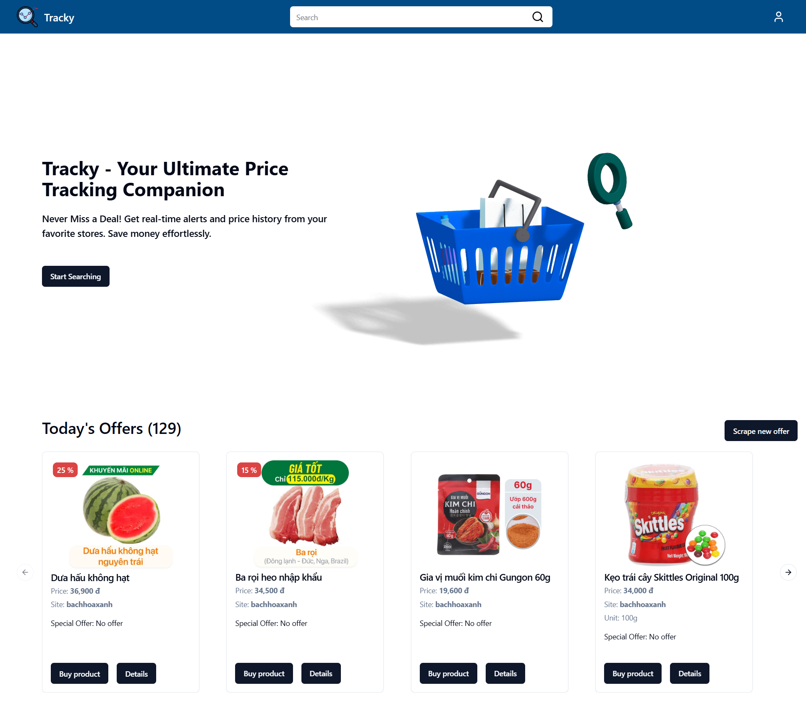
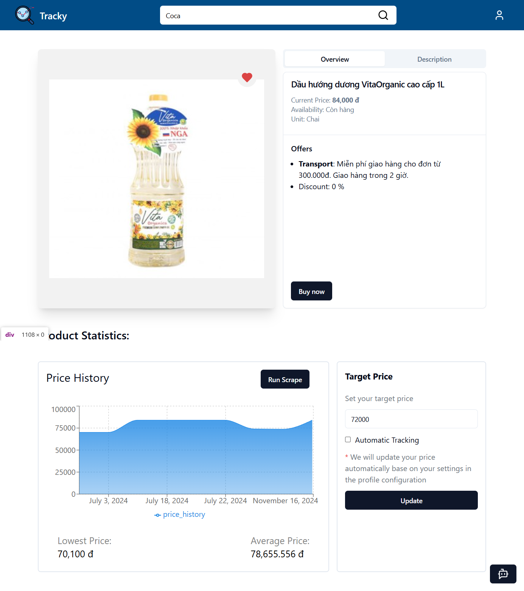
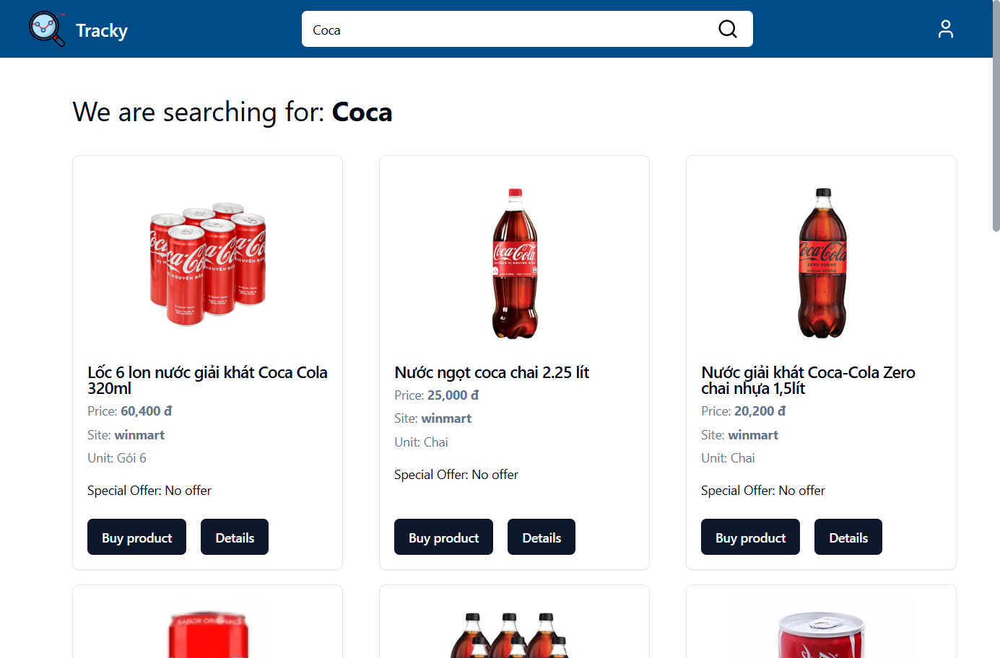

# Tracky - E-commerce Price Tracker

**Tracky** is a full-featured e-commerce price tracking web application built using the **MERN Stack**. Tracky empowers users to track product prices across various e-commerce platforms, set target prices, and receive email when prices drop below their targets. The app also features a chatbot powered by the **llama3-8b-8192 model from Meta**, enabling users to inquire about product details.

## Features

- **Price Tracking**: Track prices of products across multiple e-commerce websites.
- **Automatic Scraping**: Regular scraping of product pages using Puppeteer and Cheerio to update prices automatically.
- **Price Alerts**: Sends email notifications when the price of a tracked product drops below the user's target price.
- **Chatbot Integration**: Ask questions about tracked products via an AI-powered chatbot.
- **User Authentication**: Secure user registration and login with email authentication.
- **Responsive UI**: Built with Shadcn UI and Tailwind CSS for a modern, responsive design.

## Tech Stack

### Frontend

- **ReactJS**: UI development
- **Redux**: State management
- **Shadcn UI + Tailwind CSS**: Styling

### Backend

- **ExpressJS**: RESTful API
- **Puppeteer & Cheerio**: Scraping e-commerce websites
- **MongoDB**: Database for storing user data, product details, and tracking records
- **Redis**: Cache and session management

### Additional Tools

- **NodeMailer**: For sending email alerts
- **CronJobs**: For automation
- **JWT**: For authentication
- **Llama 2 - 8B Model (Meta)**: AI-powered chatbot to interact with users

## Overview

1. Landing Page



2. Product Page



3. Search For Products



4. Interact with chat bot


### See more project's sample in Images folder

## Installation

1. **Clone the repository**:
   ```terminal
   git clone https://github.com/DQuang7403/Tracky-Ecommerce-Price-Tracker.git
   cd Tracky-Ecommerce-Price-Tracker
   ```
2. **Install dependencies for both the frontend and backend**:

   ```terminal
   # Navigate to the backend
   cd server
   npm install

   # Navigate to the frontend
   cd ../client
   npm install
   ```

3. ** Configure environment variables**:

   Create .env files in the backend and frontend folders and add necessary environment variables.
   Example for the backend .env

   ```env server
   MONGODB_URI=mongodb+srv://...

   ACCESS_TOKEN_SECRET=random key
   REFRESH_TOKEN_SECRET=random key

   #CronJob host email
   GMAIL_USER=your_email_service
   GMAIL_PASSWORD=password

   #Redis setup
   REDIS_HOST=redis cloud host url
   REDIS_PORT=redis_port
   REDIS_USERNAME=redis username
   REDIS_PASSWORD=redis password
   GROQ_API_KEY=groq api key
   ```

   ```env client
      VITE_BACKEND_API_URL=http://localhost:5000/api/
   ```

4. **Run the application**:

   ```terminal
   # Start the backend server
   cd server
   npm start

   # Start the frontend server

   cd ../client
   npm run dev
   ```

5. **Access the Application**:

   Once both frontend and backend servers are running, visit http://localhost:5173/ in your web browser to access the application while the server running on http://localhost:5000/

## Contributing

Contributions are welcome! Please fork this repository, make changes, and submit a pull request.
